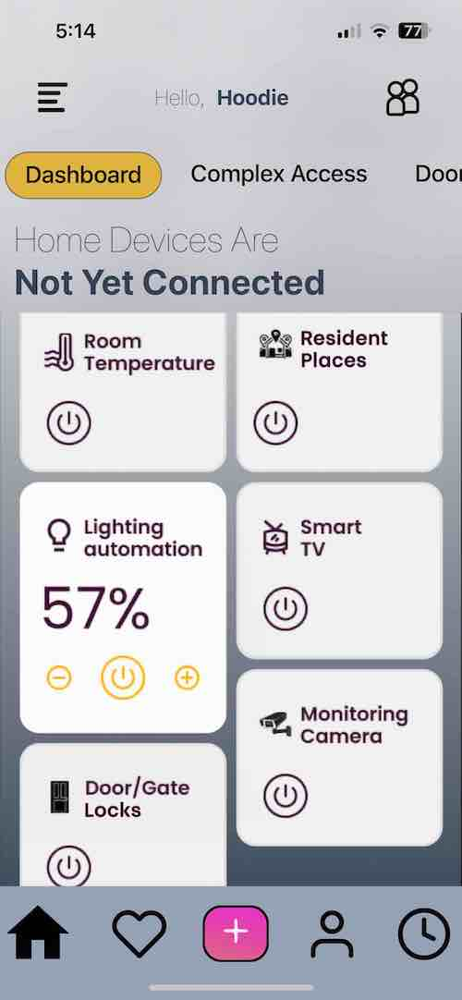

# My Current Work:

This is the development foundations of an IoT Smart Building Mobile App, built with Reat-Native, Node.js, Sequelize ORM, MySQL

## Purpose of App:

Our app is designed to make life in an apartment complex easier and more convenient. With just a few taps on your phone, you can gain access to all the facilities in your complex, unlock your apartment door, control your lighting, and pay your rent. It's the ultimate tool for smart living in an apartment complex!

<div align="center">Home Screen and Dashboard: </div>
<br/>
<div align="center">
<kbd>

</kbd>
</div>
<br />

## Technologies

### Backend Development

- Node.js
- Express
- Bcrypt
- Helmet
- JWT
- Sequelize ORM
- MySQL

### Frontend Development

- React-Native
- Tailwind
- React Context API
- JavaScript (ES6)
- HTML5
- CSS3

## Code Examples

### Node.js/Express.js

```Node
  const updateProfilePhoto = async (req, res) => {
	const token = req.headers.authorization.split(' ')[1];
	const decoded = jwt.verify(token, jwtConfig.secret);
	const id = decoded.id;
	const photo = req.file.filename;
	if (id) {
		try {
			// Find or create a profile with the given id
			const [userProfile, created] = await Profile.findOrCreate({
				where: { userId: id },
				defaults: {
					photoUrl: photo,
				},
			});

			// Update the photoUrl field
			if (photo) userProfile.photoUrl = photo;

			// Save the updated profile to the database
			await userProfile.save();

			res.status(200).json({ message: 'photo updated' });
		} catch (err) {
			res.status(500).json(err);
			console.log({ error: err.message });
		}
	} else {
		res.status(400).json({ message: 'No user found' });
	}
};

```

### JavaScript/React-Native

```
//update profile info
export const updateProfileInfo = async (updateData) => {
	try {
		const { status, data } = await API.put('/api/profile', updateData);
		if (status === 200) {
			return data;
		} else {
			console.log(`Error: ${status}`);
			return null;
		}
	} catch (error) {
		console.log(error.message);
		return;
	}
};

//get profile photo
export const getProfilePhoto = async () => {
	try {
		const { status, data } = await API.get('/api/profilephoto', {
			responseType: 'blob',
		});
		if (status === 200) {
			return data;
		} else {
			console.log(`Error getting photo: ${status}`);
			return null;
		}
	} catch (error) {
		console.log(error.message);
	}
};

```

## Features

- Full stack mobile app utilizing MySQL, Express.js, React-Native, and Node.js with state mangagement using context API.
- Authorization and authenication implemented with JWT and bcrypt. Custom hook to protect front end routes and re-direct to login.
- Tailwind styling and layout with react-native-paper components.
- Users can create an account and fill in their profile info and uplaod a profile photo.

## Status

The project is in early development.

## Contact

Created by [Jesse Hall](https://www.linkedin.com/in/jessehall/)
Feel free to contact me for any questions!

```

```
